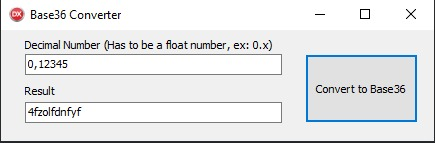

 

<h1 align="center">
    Demo Base36 Converter
</h1>

## 💻 Sobre

Essa demo foi criada com o intuito de converter um número decimal fracionado para base 36. Ou seja, números quebrados como por exemplo: 0.1234...

---

## ⚙️ Funcionalidades

- [x] Obter um número decimal (base10) e gerar uma string em base36.

---

## 🚀 Como executar o projeto

### Pré-requisitos

* A demo foi criada no Delphi 10.3 (Não foi testado o funcionamento em outros Delphis mas é provável que funcione 😁).

---

## 🎲 Guia da Demo

* No primeiro campo deve-se inserir o número decimal;

* O Botão então erá convertê-lo para base36;

* O resultado aparecerá no segundo campo.

  

---

This demo was created with the intention of convert a fractional decimal number (base 10) to a base 36. That is, broken numbers such as: 0.1234...